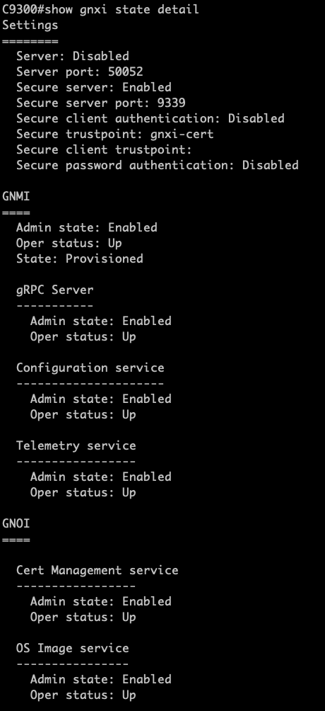

## **[IOS XE Programmability Lab](https://github.com/jeremycohoe/cisco-ios-xe-programmability-lab)**

## **Module: gNOI OS.proto operating system API**

## Version: 17.6

## Topics Covered 
Introduction to gNMI

Enabling the API

Tooling 

Use Cases and examples


## Introduction to gNOI

gNOI is the gRPC Network Operations Interface. gNOI defines a set of gRPC-based microservices for executing operational commands on network devices. OS Install, Activate, and Verification are defined and addressed here:
https://github.com/openconfig/gnoi/blob/master/os/os.proto

The OS service provides an interface for OS installation on a Target. The Client progresses through 3 RPCs:
1) Installation - provide the Target with the OS package.
2) Activation - activate an installed OS package.
3) Verification – verify the installed and activated version


## Enabling the gNMI Interface

The gNMI interface has already been enabled as part of the ZTP / day 0 process. The following CLI's are used to enable gNMI in secure mode with a self-signed certificate:

```
gnxi
gnxi secure-init
gnxi secure-server
gnxi secure-port 9339
```

## Verify GNMI and GNOI with show CLI

Use the **show gnxi state detail** CLI to check the status of both the GNMI interface as well as the GNOI 

```
C9300#show gnxi state detail
Settings
========
  Secure server: Enabled
  Secure server port: 9339

...

  OS Image service
  ----------------
    Admin state: Enabled
    Oper status: Up
    Supported: Supported


```

## Provision gNMI

Loading the TLS certificates that are required for use with the GNMI API, this can be done using the gnoi_cert tooling as shown below. 

Copy the command to provision the certificates:

**cd ~/gnmi_ssl/certs/ ; /home/auto/gnoi_cert -target_addr c9300:9339 -op provision -target_name c9300 -alsologtostderr -organization "jcohoe org" -ip_address 10.1.1.5 -time_out=10s -min_key_size=2048 -cert_id gnxi-cert -state BC -country CA -ca ./rootCA.pem -key ./rootCA.key**

You will see a log message like "Install Successfull"


## Validating gNMI provisioned

gnoi_cert was used to install the 'gnxi-cert' for use with the gNMI API interface. Check the status of the gNMI with the following CLI:

**show gnxi state detail**

The ouptut should look similar. Note the **Secure trustpoint** is listed as **gnxi-cert** and that **GNMI** is in **State: Provisioned**



This concludes the gNOI cert.proto section as the certifcate has been installed into the device's truststore and is available for use with gNMI.


## Use OS.proto to verify current version

The gnoi_os tooling is available from https://github.com/google/gnxi/tree/master/gnoi_os and has already been installed into the Linux VM. If needing to reinstall or install this in your own lab, the commands to install the gnoi_os tooling would be similar to the following:

```
go get github.com/google/gnxi/gnoi_os
go install github.com/google/gnxi/gnoi_os
```

Use the command below to **verify** the current running IOS XE version by using the **gnoi_os** verify operation:

**cd ~/gnmi_ssl/certs ; gnoi_os -insecure -target_addr 10.1.1.5:9339 -op verify -target_name c9300 -alsologtostderr -cert ./client.crt -ca ./rootCA.pem   -key ./rootCA.key**

The output should be similar to the following:

```
Running OS version: 17.06.01.0.1005.1623134733
```

## Use OS.proto install operation

OS.proto supports the install operation that can be used to upgrade the devices software to a different version. 


**gnoi_os -insecure -target_addr 10.1.1.3:9339 -op install -target_name c9300 -alsologtostderr -cert ./client.crt -ca ./rootCA.pem   -key ./rootCA.key -version 17.06.01.0.135639.1618187331 -time_out 999s -os /tftpboot/cat9k_iosxe.17.06.01-20210411.bin**


## Conclusion

In this module the gNMI YANG Model Driven Programmatic interface (API) has been configured and enabled in both secure and non-secure modes. The YANGSuite and gNMI_cli tools have been used to interact with the gNMI API interface using the GUI and CLI based tooling to perform basic GET operations.


