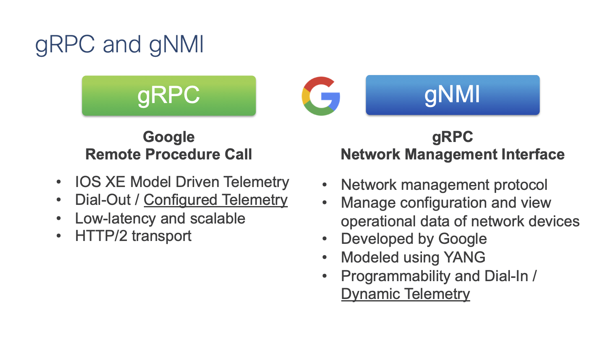

## **[IOS XE Programmability Lab](https://github.com/jeremycohoe/cisco-ios-xe-programmability-lab)**

## **Module: gNOI cert.proto certificate management API**

## Topics Covered 
Introduction to gNMI

Enabling the API

Tooling 

Use Cases and examples

## Introduction to gNOI

gNOI is the gRPC Network Operations Interface. It has been enabled on IOS XE 17.3 with support for the "certificate protocol buffer", or cert.proto for short. The gNOI cert.proto is the certificate management API - it enables programmatic operations for working with TLS/SSL/crypto CLI and certificiates. Essentially it enables network operators to more effeciently load crypto into the network device via an API.

gNOI is part of the gNMI API interface. The gNMI Model Driven Programmatic Interface is part of the **Device Configuration and Device Monitoring** ecosystem within Cisco IOS XE, shown below:


A review of the IOS XE Programmability and Telemetry interfaces of **gNMI, NETCONF, RESTCONF, and gRPC** is below, specifically the **YANG** data models:


The **Google Remote Procedure Call (g) Network Management Interface (NMI)**, or **gNMI** for short, is a specification of RPC's and behaviours for managing the state on network devices. It is built on the open source gRPC framework and uses the Protobuf IDL (protocol buffers interactive data language). 

Details of Protocol Buffers is available at from Google Developers at [https://developers.google.com/protocol-buffers/docs/overview](https://developers.google.com/protocol-buffers/docs/overview) while the specification for gNMI itself is available on Github/Openconfig at [https://github.com/openconfig/gnmi](https://github.com/openconfig/gnmi) and the actual gnmi.proto file is defined at [https://github.com/openconfig/gnmi/blob/master/proto/gnmi/gnmi.proto](https://github.com/openconfig/gnmi/blob/master/proto/gnmi/gnmi.proto) - These resources can be referred if needed however for the purpose of this lab is not necessary to have a deeper understanding of these concepts.



Similar to the NETCONF and RESTCONF programmatic interfaces, gNMI can be used for a variety of operations including retrieving operational and runtime details using the GET operations, as well as making configuration changes using the SET operation. The SUBSCRIBE operation supports Model Driven Telemetry, or streaming telemetry, to be enabled from this interface as well.


All of the programmatic interfaces (NETCONF, RESTCONF, gNMI, and gRPC) share the same set of YANG data models. An example is to review the interface configurations including interface descriptions which can be completed by using **any** of the programmatic interfaces using the same YANG data model: **Cisco-IOS-XE-interface-oper.YANG**. 


## Enabling the gNMI Interface

The gNMI interface has already been enabled as part of the ZTP / day 0 process. The following CLI's are used to enable gNMI in secure mode with a self-signed certificate:

```
gnxi
gnxi secure-init
gnxi secure-server
gnxi secure-port 9339
```


### Step 1

### Generate certificates

Using the gen_certs.sh script from the Cisco Innovation Edge github at [https://raw.githubusercontent.com/cisco-ie/cisco-gnmi-python/master/scripts/gen_certs.sh](https://raw.githubusercontent.com/cisco-ie/cisco-gnmi-python/master/scripts/gen_certs.sh) we can easily generate certificates. This script follows the steps that are outlined in the above IOS XE 16.12 Programmability Configuration Guide link.

To generate the certificates lets follow these steps:

```
cd ; cd gnmi_ssl
bash gen_certs.sh
bash gen_certs.sh c9300 10.1.1.5 Cisco12345
```

The gen_certs.sh command above will generate the required certificates for loading into IOS XE for use with the secure gNMI API.

### Step 2

### Load Certificates

The gnoi_cert tooling is available from https://github.com/google/gnxi/tree/master/gnoi_cert and has already been installed. If needing to reinstall or install this in your own lab, the commands to install the gnoi_cert tooling would be similar to the following:

```
go get github.com/google/gnxi/gnoi_cert
go install github.com/google/gnxi/gnoi_cert
```

Loading the certificates can be done using the gnoi_cert tooling as shown below. 

The name of the crypto trustpoint is specified in the "cert-id" field which is set to **gnxi-cert**

Copy the command to provision the certificates:

**cd ~/gnmi_ssl/certs/ ; /home/auto/gnoi_cert -target_addr c9300:9339 -op provision -target_name c9300 -alsologtostderr -organization "jcohoe org" -ip_address 10.1.1.5 -time_out=10s -min_key_size=2048 -cert_id gnxi-cert4 -state BC -country CA -ca ./rootCA.pem -key ./rootCA.key**

You will see a log message like "Install Successfull"


### Step 3

### Review certificate installation


Review details of the trustpoint using the **show crypto pki trustpoints** CLI's

```
show crypto pki trustpoints  | i Trustpoint
show crypto pki trustpoints
```


### Step 4

The gNMI API has now been securely enabled using gNOI cert.proto to install the certificate and restart the service.


## Validating secure gNMI with gmmi_cli tooling

There are two main options for working with the gNMI API: CLI or GUI based tooling. 

The gnmi_cli CLI based tooling provides a sample use case where the device hostname is retreived, and the YangSuite GUI based toolinng provides a much richer user experience when first working with the API.

### gnmi_cli with TLS and the gNMI secure-server on port 9339

The GNMI_CLI tooling is available from [https://github.com/openconfig/gnmi](https://github.com/openconfig/gnmi) and has already been installed in the lab envrionment's Ubuntu VM using the following workflow.

1. Download the go version 1.14 from https://golang.org/dl/
2. Untar the file
3. Move it to /usr/local
4. Set the GOROOT variable
5. Set the PATH variable to include the GOROOT bin
6. "Go get" gnmi_cli from Github

The steps that were required to install Go and the gnmi_cli tool are listed here for reference should you wish to install the tooling in your own lab envrionments.
```
wget https://dl.google.com/go/go1.14.4.linux-amd64.tar.gz
tar xvfz go1.14.4.linux-amd64.tar.gz
sudo mv go /usr/local/
export GOROOT=/usr/local/go
export PATH=$GOPATH/bin:$GOROOT/bin:$PATH
go get -u github.com/openconfig/gnmi/cmd/gnmi_cli
```

The gnmi_cli tool has been installed and is ready for use:

```
auto@automation:~$ gnmi_cli --help
```


A GET operation to retreive the device hostname can be sent using the following **gnmi_cli** command. First change directory (cd) into **~/gnmi_ssl/certs**  then send the **gnmi_cli -address ....** command with all the options defined:

```
auto@automation:~$ cd ~/gnmi_ssl/certs/

auto@automation:~/gnmi_ssl/certs$ 

gnmi_cli -address c9300:9339 -server_name c9300 -with_user_pass -timeout 10s -get \
-ca_crt rootCA.pem -client_crt client.crt -client_key client.key \
-proto "$(cat ~/gnmi_proto/get_hostname.txt)"
```

In this example the payload is defined with the -proto flag and contains the folowing YANG modeled data


The **get_hostname.txt** proto file defines which YANG data model and elements to retreive:

```
auto@automation:~$ cat ~/gnmi_proto/get_hostname.txt
path: <
  elem: <
    name: "system"
  >
  elem: <
    name: "config"
  >
  elem: <
    name: "hostname"
  >
>
encoding: JSON_IETF
auto@automation:~$
```

The gNMI secure server replies with the resulting payload:

```
  timestamp: 1592947803699765348
  update: <
    path: <
      elem: <
        name: "system"
      >
      elem: <
        name: "config"
      >
      elem: <
        name: "hostname"
      >
    >
    val: <
      json_ietf_val: "\"C9300\""
    >
  >
>

```

The complete workflow should look similar to the following:


## Conclusion

In this module the gNMI YANG Model Driven Programmatic interface (API) has been configured and enabled in both secure and non-secure modes. The YANGSuite and gNMI_cli tools have been used to interact with the gNMI API interface using the GUI and CLI based tooling to perform basic GET operations.


